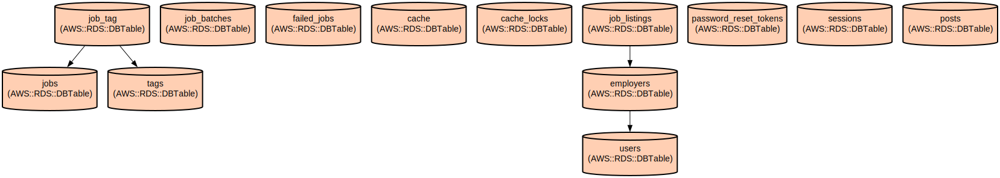

# Job Board Platform - A Laravel-based Job Listing and Management System

The Job Board Platform is a modern web application built with Laravel that enables employers to post, manage, and track job listings while providing job seekers with an intuitive interface to browse available positions. The platform features user authentication, job management capabilities, and a responsive design powered by Tailwind CSS.

The application provides comprehensive job listing management with features including:
- User registration and authentication system with role-based access control
- Job posting functionality with title, location, and salary information
- Tag-based job categorization for improved searchability
- Email notifications for new job postings and user registrations
- Responsive interface that works across desktop and mobile devices
- Pagination support for job listings
- Role-based permissions for job management

## Repository Structure
```
.
├── app/                          # Core application code
│   ├── Http/Controllers/         # Request handling logic
│   ├── Mail/                     # Email notification templates
│   ├── Models/                   # Eloquent models for data entities
│   └── Policies/                 # Authorization policies
├── database/                     # Database configuration and migrations
│   ├── factories/                # Model factories for testing
│   ├── migrations/               # Database structure definitions
│   └── seeders/                 # Sample data generators
├── resources/                    # Frontend assets and views
│   ├── css/                     # Stylesheets
│   ├── js/                      # JavaScript files
│   └── views/                   # Blade template files
├── routes/                      # Application routes
│   ├── web.php                  # Web routes definition
│   └── console.php              # Console commands
└── config/                      # Configuration files
```

## Usage Instructions

### Prerequisites
- PHP >= 8.2
- Composer
- Node.js and npm
- MySQL or PostgreSQL database
- Web server (Apache/Nginx)

### Installation
1. Clone the repository:
```bash
git clone <repository-url>
cd job-board-platform
```

2. Install PHP dependencies:
```bash
composer install
```

3. Install frontend dependencies:
```bash
npm install
```

4. Configure environment:
```bash
cp .env.example .env
php artisan key:generate
```

5. Configure database in .env file:
```
DB_CONNECTION=mysql
DB_HOST=127.0.0.1
DB_PORT=3306
DB_DATABASE=your_database
DB_USERNAME=your_username
DB_PASSWORD=your_password
```

6. Run migrations:
```bash
php artisan migrate
```

### Quick Start
1. Start the development server:
```bash
php artisan serve
```

2. Start the Vite development server:
```bash
npm run dev
```

3. Visit http://localhost:8000 in your browser

### More Detailed Examples

#### Creating a Job Listing
```php
// As an authenticated employer
POST /jobs
{
    "title": "Senior Developer",
    "location": "Remote - United States",
    "salary": "120000"
}
```

#### Browsing Jobs
```php
// View all jobs
GET /jobs

// View specific job
GET /jobs/{id}
```

### Troubleshooting

#### Common Issues

1. Database Connection Issues
```
SQLSTATE[HY000] [2002] Connection refused
```
- Verify database credentials in .env
- Ensure database service is running
- Check database port availability

2. Storage Permission Issues
```
The stream or file "storage/logs/laravel.log" could not be opened
```
Solution:
```bash
chmod -R 775 storage
chmod -R 775 bootstrap/cache
```

## Data Flow

The application follows a standard MVC architecture with additional service layers for business logic.

```ascii
[User/Browser] → [Routes] → [Controllers] → [Models]
       ↑                                        ↓
    [Views] ← [Response/Blade] ← [Database/Cache]
```

Key component interactions:
1. Routes direct HTTP requests to appropriate controllers
2. Controllers validate input and coordinate with models
3. Models handle data persistence and relationships
4. Views render data using Blade templates
5. Mail notifications trigger on specific events
6. Authentication middleware protects restricted routes
7. Policies enforce user-specific permissions

## Infrastructure



### Database Tables
- `users`: Stores user account information
- `employers`: Contains employer profile data
- `job_listings`: Stores job posting information
- `tags`: Manages job categorization tags
- `cache`: Handles application caching
- `sessions`: Manages user sessions
- `failed_jobs`: Tracks failed queue jobs

### Queue System
- Uses database queue driver by default
- Supports job batching and failure tracking
- Configurable retry and timeout settings